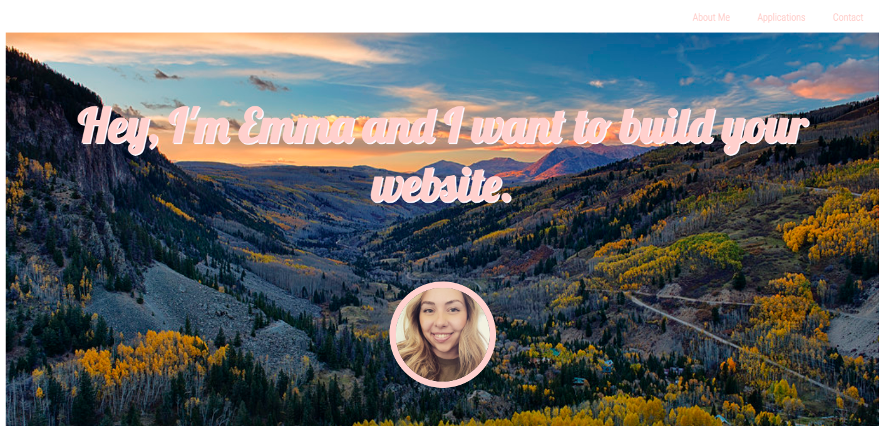
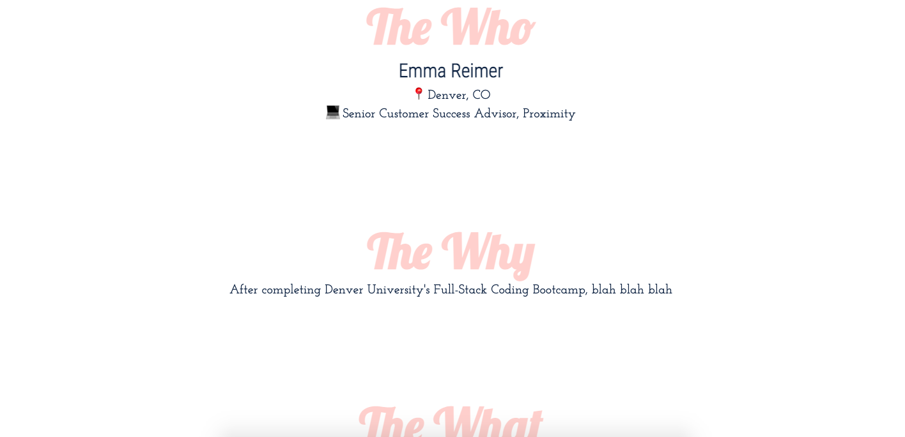
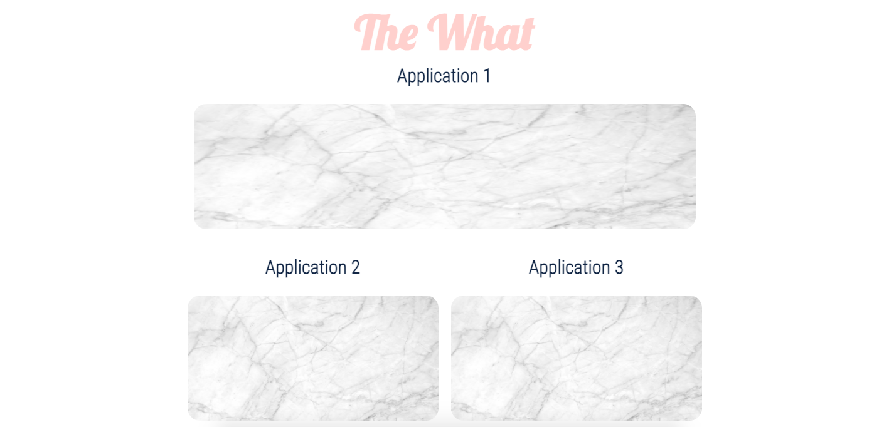

# Emma Reimer's Portfolio

The motivation behind this application is to showcase the different applications I've built as well as share information about myself and how to contact me.

## Description

The portfolio is filled with placeholders and mock data that will eventually be filled with real applications and data.

The application is responsive and interactive.

## Usage

I will keep refactoring this application and updating it with information as I learn throughout my bootcamp.

The application can be found here: https://emmareimer.github.io/portfolio/

The following images show the web application's appearance and functionality:

